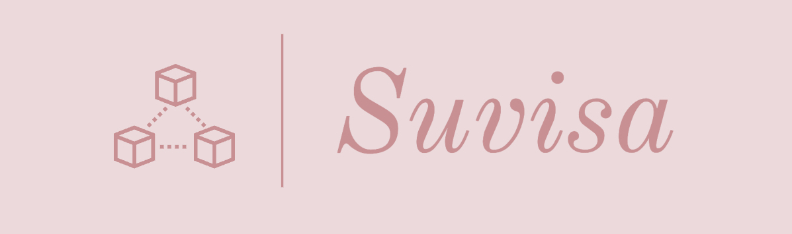

## Links

- Link to Demo: [https://www.youtube.com/watch?v=fi4TE0CAKUg]
- Link to Documentation: [https://drive.google.com/file/d/1rY42CfHj1oZAKTKVz6Xem2McT0t29YCP/view?usp=sharing]

## How we built it

### Frontend

The following technologies were used to develop the frontend for this project.

- HTML
- CSS
- JavaScript
- ReactJS

### Backend

The following technologies were used to develop the backend for this project.

- Solidity
- NodeJS(For authentication in future updates)

## How to Run the Project

### Prerequisite

- A text editor
- Metamask extension

### Set up your MetaMask wallet for development

1. Open your search engine, search for "Meta Mask Extension" and download it.
2. Open the meta mask extension
3. Click on the dropdown menu on top of the MetaMask wallet extension.
4. Click on “Add Network” and add the following parameters in the blank space.

   Network Name: Mumbai Testnet

   New RPC URL: https://rpc-mumbai.maticvigil.com/

   Chain ID: 80001

   Currency Symbol: MATIC

   Block Explorer URL: https://polygonscan.com/

5. Click on “Save” and you’re good to go.

### Usage

1. Clone the repository

```
git clone https://github.com/Sk47R/Suvisa.git
```

2. Navigate to the repository :open_file_folder:

```
cd suvisa
```

3. Install the dependencies

```
npm install
```

4. Create a .env file on the root folder of the project and setup the environment variables

   For example:

```
#.env
PRIVATE_KEY = "your_private_key";
PRIVATE_API_URL = "your_private_api_url";
REACT_APP_PINATA_KEY = "your_react_app_pinata_key"
REACT_APP_PINATA_SECRET = "your_react_app_pinata_secret"
```

5. Run the development server

```
npm start
```

###
